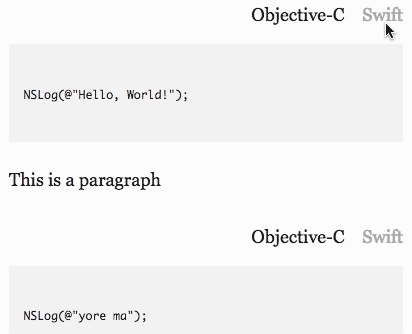

# hipsterpress
A WordPress plugin to easily switch between Objective-C and Swift code, inspired by [NSHipster.com](http://nshipster.com).
To install, download this repository as a zip and upload to your WordPress installation.
Detailed instructions contained in the WordPress plugin readme below
## Licence
License: GPLv2 or later
License URI: http://www.gnu.org/licenses/gpl-2.0.html

## Description 

This is a plugin which attempts to mimic the behaviour of NSHipster by including Objective-C and Swift code, with syntax highlighting, and the ability to toggle between them. This plugin is only loaded when there is Objective-C and Swift code being displayed.

## Installation 

Download the zip file and add a new plugin in WordPress
Objective-C and Swift code must directly follow each other, and they must each wrapped in `<pre><code>` tags.
You must use the classes `<code class="language-objc">` and `<code class="language-swift">`
Example:
```
<pre>
<code class="language-swift">
print("Hello, World!")
</code>
</pre>
<pre>
<code class="language-objc">
NSLog(@"Hello, World!");
</code>
</pre>
```

## Frequently Asked Questions 

= Does it matter if I include Objective-C or Swift first? =
No - either order is fine, as long as you are consistent. 

## Changelog 

18-Nov-16 - initial commit

## Upgrade Notice

No upgrades yet

## Screenshots 

1. Swapping between Objective-C and Swift
